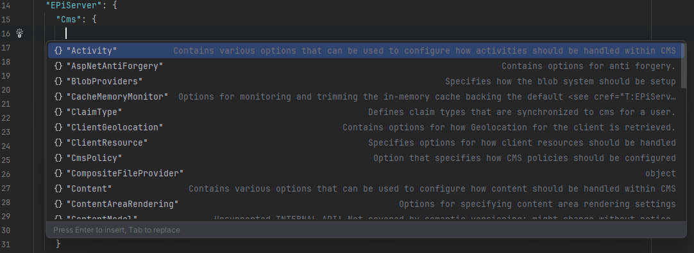

# Optimizely-Json-Schema
Json schema for appsettings when working with Optimizely CMS. 

## Options
Currently only support CMS and it's deppendencies. More options will be added in future. 

The schema contains following options:

### Cms

EPiServer.DataAbstraction.Activities.ActivityOptions

EPiServer.Framework.Web.AspNetAntiForgeryOptions

EPiServer.Framework.Blobs.BlobProvidersOptions

EPiServer.Framework.Cache.CacheMemoryMonitorOptions

EPiServer.Security.ClaimTypeOptions

EPiServer.Personalization.ClientGeolocationOptions

EPiServer.Framework.Web.Resources.ClientResourceOptions

EPiServer.Authorization.CmsPolicyOptions

EPiServer.Framework.Hosting.CompositeFileProviderOptions

EPiServer.Web.Templating.ContentAreaRenderingOptions

EPiServer.DataAbstraction.RuntimeModel.Internal.ContentModelOptions

EPiServer.Core.ContentOptions

EPiServer.Data.DataAccessOptions

EPiServer.Web.DisplayOptions

EPiServer.Data.Dynamic.DynamicDataStoreOptions

EPiServer.Framework.EnvironmentOptions

EPiServer.Events.EventProviderOptions

EPiServer.Core.ExternalApplicationOptions

EPiServer.Framework.Blobs.FileBlobProviderOptions

EPiServer.Web.FirstRequestInitializerOptions

EPiServer.Globalization.GlobalizationSettingsOptions

EPiServer.Web.Internal.HtmlOptions

EPiServer.Formatters.JsonFormatterOptions

EPiServer.Shell.Licensing.LicensePathOptions

EPiServer.LinkAnalyzer.LinkValidatorOptions

EPiServer.Framework.Internal.LinuxEnvironmentOptions

EPiServer.Framework.Localization.LocalizationOptions

EPiServer.Security.MappedRolesOptions

EPiServer.Web.MediaOptions

EPiServer.Notification.NotificationOptions

EPiServer.Cms.Shell.UI.RegisterAdminUserOptions

EPiServer.Web.Routing.RoutingOptions

EPiServer.Scheduler.SchedulerOptions

EPiServer.Core.Html.StringParsing.ScriptParserOptions

EPiServer.Personalization.VisitorGroups.SearchWordCriterionOptions

EPiServer.Web.Internal.SimpleAddressOptions

EPiServer.Framework.SmtpOptions

EPiServer.Formatters.SystemTextJsonSettingsOptions

EPiServer.Web.Mvc.TagHelperOptions

EPiServer.Web.Templating.TemplateOptions

EPiServer.Web.UrlSegmentOptions

EPiServer.Validation.ValidationOptions

EPiServer.Security.VirtualRoleOptions

EPiServer.Personalization.VisitorGroups.VisitorGroupOptions

EPiServer.Web.Hosting.ZipArchiveFileProviderOptions

### CmsUI

EPiServer.Cms.UI.Admin.AdminOptions

EPiServer.Cms.UI.AspNetIdentity.ApplicationOptions

EPiServer.Cms.Shell.UI.Approvals.Notifications.ApprovalNotificationOptions

EPiServer.Cms.Shell.UI.Configurations.CmsFeatureOptions

EPiServer.Shell.Dashboard.Internal.DashboardOptions

EPiServer.Cms.Shell.UI.Configurations.HeadlessModeOptions

EPiServer.Cms.Shell.UI.Configurations.ImageEditorOptions

EPiServer.Cms.Shell.UI.ObjectEditing.EditorDescriptors.InlineBlockNamePropertiesOptions

EPiServer.Shell.Navigation.NavigationOptions

EPiServer.Cms.Shell.UI.Rest.Projects.ProjectUIOptions

EPiServer.Shell.Modules.ProtectedModuleOptions

EPiServer.Shell.Modules.PublicModuleOptions

EPiServer.Cms.Shell.UI.Rest.Cache.RestCacheOptions

EPiServer.Shell.ViewComposition.SecuredComponentOptions

EPiServer.Cms.Shell.UI.ObjectEditing.EditorDescriptors.SelectionFactories.SelectionFactoriesOptions

EPiServer.Shell.Telemetry.TelemetryOptions

EPiServer.Web.UIOptions

EPiServer.Shell.UI.UIShellModuleOptions

EPiServer.Cms.Shell.UI.Configurations.UploadOptions

EPiServer.Personalization.VisitorGroups.UserProfileCriterionOptions

EPiServer.Shell.ViewComposition.ViewOptions

### Telemetry

EPiServer.Telemetry.UI.TelemetryOptions

### TinyMce

EPiServer.Cms.TinyMce.Core.TinyMceConfiguration

EPiServer.Cms.TinyMce.PropertySettings.Internal.TinyMcePropertySettingsOptions

## How to use?
1. Download `appsettings-schema.json` and put in your project (same root folder with `appsettings.json`)
2. Modify your `appsettings.json` and add `"$schema": "appsettings-schema.json"` to the top.
